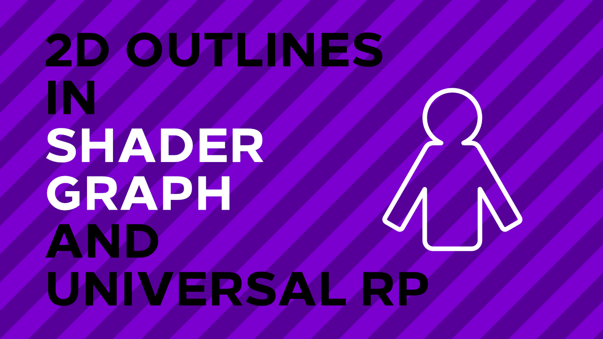

# 2D Outlines in Shader Graph and Unity URP

A 2D outline shader for SpriteRenderers in Unity, using Shader Graph and Universal RP.

## Overview

This project features a 2D outline shader for SpriteRenderer components which 'duplicates' the sprite four times and offsets those duplicates along the cardinal directions. The duplicates are tinted according to a defined outline colour. An accompanying tutorial is available on [danielilett.com](https://danielilett.com/2020-04-27-tut5-6-urp-2d-outlines/).

## Software

This project was created using Unity 2019.3.0f6 and Universal Render Pipeline 7.1.8.

## Authors

This project and the corresponding tutorial series were written by Daniel Ilett. [Follow him on Twitter](https://twitter.com/daniel_ilett) for more gamedev tutorials!

## Release

This project was released on April 27th 2020.
